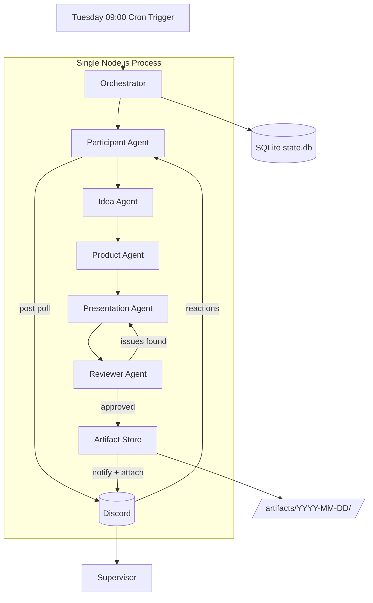
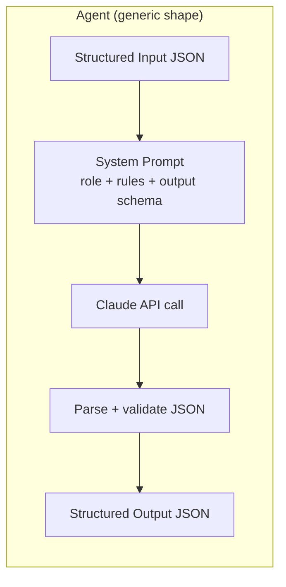
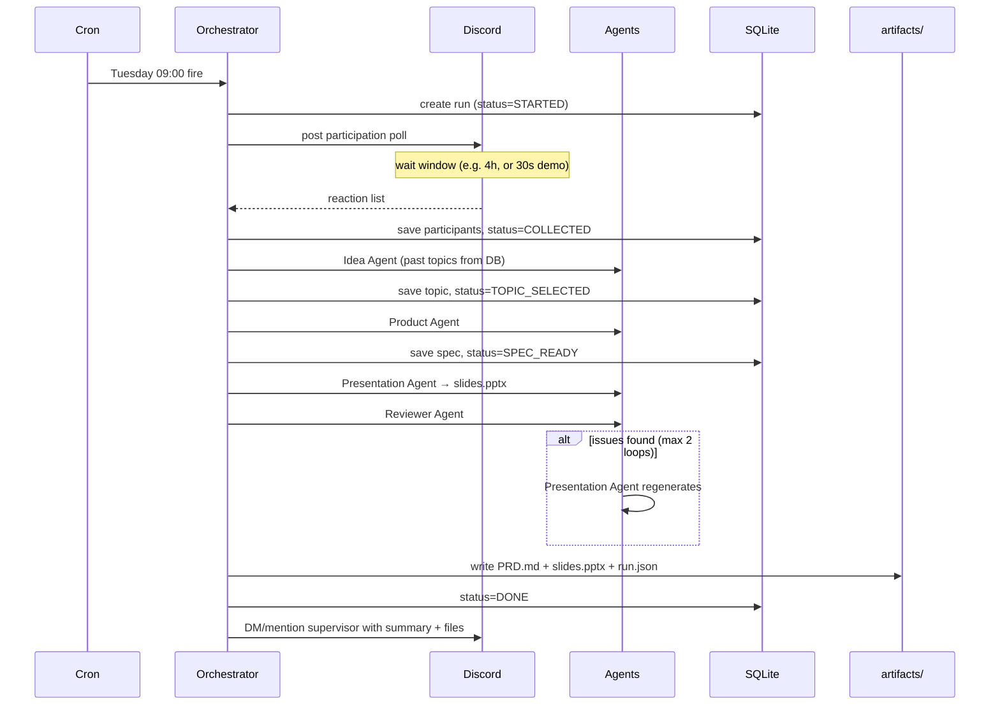
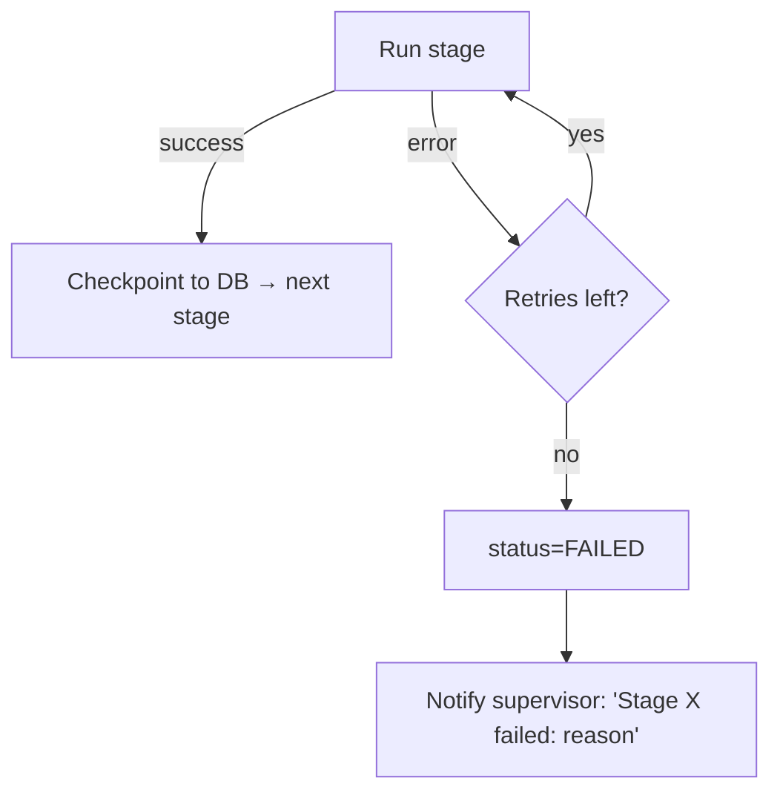

# ARCHITECTURE.md — Autonomous CodeCrunch Organizer

> Hackathon build. One Node.js process, one SQLite file, one Discord bot, five LLM agents. Nothing more.

---

## 1. High-Level Architecture

The whole system is a **single long-running Node.js process** that does three things:

1. **Waits** — a cron scheduler fires every Tuesday at 09:00.
2. **Talks** — a Discord bot asks participants if they're in, collects reactions, and pings the supervisor at the end.
3. **Thinks** — a pipeline of five LLM-backed agents turns "it's Tuesday" into a topic, a PRD, and a reviewed PPTX.



No message queues, no microservices, no cloud infra. The process runs on your laptop (or a free-tier VM) and that's the demo.

---

## 2. Agent Architecture

Every agent is the same shape: **a function that takes structured input, calls Claude with a role-specific system prompt, and returns structured JSON output.** Agents don't talk to each other — the orchestrator passes outputs forward like a relay baton.



```typescript
// Every agent implements this
type Agent<In, Out> = (input: In, ctx: RunContext) => Promise<Out>;
```

This keeps agents testable in isolation (feed fake input, check output shape) and makes retries trivial (re-call the function).

---

## 3. Agent Responsibilities

| Agent | Input | Output | Notes |
|---|---|---|---|
| **Participant Agent** | Discord channel ID | `{ participants: string[], count: number }` | Posts poll message with ✅/❌ reactions, waits N hours (configurable, 30s in demo mode), collects reactors |
| **Idea Agent** | Participant count, past topics from DB | `{ topic, tagline, difficulty, whyFun }` | Reads past topics from SQLite to avoid repeats. Picks difficulty based on headcount |
| **Product Agent** | Selected topic | `{ problemStatement, requirements[], acceptanceCriteria[], stretchGoals[] }` | Produces the "spec" participants build against |
| **Presentation Agent** | Product spec | Path to generated `.pptx` | Generates slide content as JSON, renders with pptxgenjs. 5–7 slides |
| **Reviewer Agent** | Spec + slide content JSON | `{ approved: boolean, issues[], fixedContent? }` | Checks clarity, feasibility in one evening, AC testability. Max 2 review loops, then force-approve with warnings logged |

---

## 4. Workflow / Data Flow



**State machine per run:** `STARTED → COLLECTED → TOPIC_SELECTED → SPEC_READY → SLIDES_READY → REVIEWED → DONE` (or `FAILED` from any state). Each transition is written to SQLite, which is what makes resume-on-crash possible.

---

## 5. Scheduler

- **node-cron** inside the main process. Cron expression `0 9 * * 2` (Tuesday 09:00).
- **Demo mode:** `RUN_NOW=true npm start` skips the cron and fires immediately — critical for the hackathon demo, you're not waiting until Tuesday.
- **Idempotency:** before starting, check SQLite for an existing run with today's date. If one exists and isn't `FAILED`, skip. Prevents double-fires on restart.

No external scheduler (no GitHub Actions, no cloud cron) — one less thing to break during the demo.

---

## 6. Discord Integration

One bot, one server, two channels:

- `#codecrunch` — the poll goes here. Bot posts an embed: "🍩 CodeCrunch tomorrow! React ✅ if you're in." Reactions are the RSVP mechanism (zero-friction, no slash-command plumbing needed).
- `#codecrunch-ops` — supervisor notifications. Final message mentions the supervisor (`<@SUPERVISOR_ID>`), includes topic, headcount, and attaches the PPTX + PRD.md directly (Discord allows file attachments up to 25MB — plenty).

**Library:** discord.js v14. Needed intents: `Guilds`, `GuildMessages`, `GuildMessageReactions`, `MessageContent`.

**Collecting responses:** `message.awaitReactions({ time: WINDOW_MS })` — built-in, no polling loop needed.

---

## 7. Database / State Management

**SQLite via better-sqlite3** (synchronous, zero-config, one file). Three tables:

```sql
CREATE TABLE runs (
  id INTEGER PRIMARY KEY,
  run_date TEXT UNIQUE,          -- '2026-08-11'
  status TEXT,                   -- state machine value
  topic TEXT,
  participant_count INTEGER,
  created_at TEXT,
  updated_at TEXT
);

CREATE TABLE participants (
  run_id INTEGER REFERENCES runs(id),
  discord_user_id TEXT,
  username TEXT
);

CREATE TABLE artifacts (
  run_id INTEGER REFERENCES runs(id),
  kind TEXT,                     -- 'prd' | 'pptx' | 'run_json'
  path TEXT
);
```

The `runs.status` column doubles as the checkpoint: on crash + restart, the orchestrator reads the latest run and resumes from the last completed stage instead of starting over.

---

## 8. Artifact / PPTX Generation

**Two-step generation** (this is the trick that keeps quality high):

1. **Presentation Agent** outputs pure JSON: `{ slides: [{ title, bullets[], speakerNotes }] }`. The LLM never touches layout.
2. A dumb **renderer** maps that JSON onto **pptxgenjs** with a fixed template (title slide, agenda, problem, requirements, acceptance criteria, "go build" slide). Consistent fonts/colors, no LLM layout hallucinations.

Everything for a run lands in `artifacts/YYYY-MM-DD/`:

```
artifacts/2026-08-11/
├── PRD.md          # Product Agent output rendered to markdown
├── slides.pptx     # Presentation Agent + renderer
└── run.json        # full pipeline trace (inputs/outputs per agent) — great for debugging AND demo
```

---

## 9. Failure / Retry Handling

Hackathon-appropriate, i.e., simple but real:

| Failure | Handling |
|---|---|
| LLM call fails / bad JSON | Retry up to 3× with exponential backoff (1s, 3s, 9s). On JSON parse failure, re-prompt with the parse error appended |
| Reviewer keeps rejecting | Hard cap at 2 review loops → force-approve, log issues into `run.json`, mention them in supervisor message ("⚠️ shipped with 2 open review notes") |
| Zero participants respond | Don't abort — generate anyway with a "low turnout" note to supervisor. (Demo-friendly: pipeline always completes) |
| Discord down / send fails | Retry 3×, then write artifacts locally anyway and log the failure. Artifacts are never lost |
| Process crashes mid-run | On restart, resume from `runs.status` checkpoint |
| Any unrecoverable error | Set `status=FAILED`, send supervisor a failure message with the stage that died. **The supervisor always hears something** — silence is the worst failure mode for an "autonomous" system |



---

## 10. Recommended Tech Stack

| Layer | Choice | Why |
|---|---|---|
| Runtime | Node.js 22 + TypeScript | Fast to write, typed agent I/O |
| LLM | Anthropic Claude API (`claude-sonnet-4-6`) | Strong structured output, one model for all agents |
| Discord | discord.js v14 | Mature, reaction collectors built in |
| Scheduler | node-cron | In-process, one line |
| Database | better-sqlite3 | Zero setup, sync API, single file |
| PPTX | pptxgenjs | Pure JS, no LibreOffice/Office dependency |
| Validation | zod | Validate every agent's JSON output at the boundary |
| Config | dotenv | Tokens + channel IDs in `.env` |

**Explicitly NOT using:** LangChain/agent frameworks (overhead), Postgres (overkill), Redis/queues (single process), Docker (demo runs on laptop). Every one of these would eat your 3 hours.
